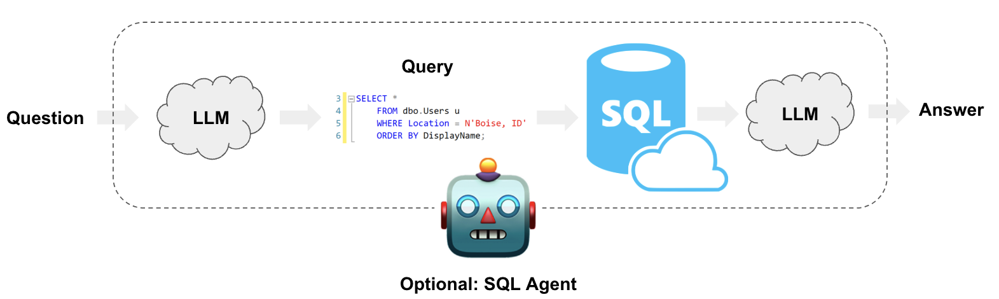

# Build a RAG application over a SQL database (Ollama Edition)

## Overview

This project is a clone of the [sql-rag](../README.md) project, adapted to use a **local LLM via Ollama** instead of Google's Gemini 1.5 Flash. Specifically, it uses the **Ollama Llama 2.5 7B** model (`llama3.1` / your configured model name).

At a high-level, the steps of the system are:

1. **Convert question to SQL query**: Model converts user's natural language question to a syntactically valid SQL query.
2. **Execute SQL query**: Model invokes a tool to execute the SQL query.
3. **Answer the question**: Model synthesizes an answer to the user's question using the database query results.



The code acts as a robust backend API (`api.py`) and a modern React GUI (`frontend/`) containing:
- Few-shot semantic examples (using FAISS embeddings)
- Smart question classification to reject unrelated questions
- Advanced agentic reasoning steps that self-correct bad SQL queries


## Project Directory Structure

Directory / File | Description
:--- | :---
`db` | Contains the Chinook sample database and the SQL script to re-create it.
`examples` | Contains SQL examples used for few-shot prompting (JSON format).
`prompts` | Contains prompt templates for the LLM.
`img` | Contains images.
`api.py` | FastAPI backend exposing LangGraph capabilities.
`frontend/` | React (Vite + Tailwind v4) chat UI.
`requirements.txt` | Python package dependencies.

## Prerequisites

### Ollama

1. Install [Ollama](https://ollama.com/) on your machine.
2. Pull the model:

   ```bash
   ollama pull llama3.1
   ```

3. Make sure Ollama is running (it runs on `http://localhost:11434` by default).

### Python Environment

1. Create a virtual environment:

   ```bash
   python -m venv venv
   ```

2. Activate it:

   ```bash
   # Windows
   venv\Scripts\activate

   # macOS / Linux
   source venv/bin/activate
   ```

3. Install dependencies:

   ```bash
   pip install -r requirements.txt
   ```

### Environment Variables (Optional)

Create a `.env` file in this directory if you want to use LangSmith tracing:

```dotenv
# Optional. Recommended to see what's going on
# under the hood of LangGraph and LangChain.
LANGSMITH_API_KEY="your-langsmith-secret-key"
LANGCHAIN_TRACING_V2="true"
LANGCHAIN_PROJECT="SQL RAG Ollama"
```

## Running

Open two terminal windows:

**1. Start the Backend API (Terminal 1):**
```bash
python api.py
```

**2. Start the React Frontend (Terminal 2):**
```bash
cd frontend
npm run dev
```

Navigate to [http://localhost:5173/](http://localhost:5173/) to interact with your database.
